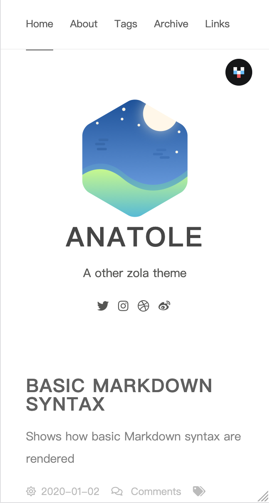

# Anatole Theme for Zola

Port [Anatole theme for farbox](https://github.com/hi-caicai/farbox-theme-Anatole) to Zola.




## Installation

First download this theme to your `themes` directory:

```bash
$ cd themes
$ git clone https://github.com/longfangsong/anatole-zola.git
```
and then enable it in your `config.toml`:

```toml
theme = "anatole-zola"
```

## Options

### Basic

Add `title`, `description` and `base_url`:

```toml
title = "Anatole"
description = "A other zola theme"
base_url = "https://example.com"
```

### Language

Currently, we have English and Chinese translation, set the `default_language` if necessary:

```toml
# 如果你想要中文
default_language = "zh"
```

Feel free to create a pull request if you want to translate the promotes into other languages!

### Sections

Tags and links sections are optional, set corresponding fields `false` if you don't want them.

```toml
[extra.show]
tags = false
links = false
```

### Sidebar menu

We support a bunch of social links, they are:

```toml
[extra.social]
github = ""
twitter = ""
facebook = ""
instagram = ""
dribbble = ""
weibo = ""
```

Fill in your username if you want! And the logo won't appear if you leave it empty.


### Comment system

We currently support [valine](https://valine.js.org/quickstart.html):

```toml
[extra.comment.valine]
appid = "Your appid goes here"
appkey = "Your appkey goes here"
notify = false # true/false: mail notify https://github.com/xCss/Valine/wiki/Valine-%E8%AF%84%E8%AE%BA%E7%B3%BB%E7%BB%9F%E4%B8%AD%E7%9A%84%E9%82%AE%E4%BB%B6%E6%8F%90%E9%86%92%E8%AE%BE%E7%BD%AE
verify = false # true/false: verify code
avatar = "mm" # avatar style https://github.com/xCss/Valine/wiki/avatar-setting-for-valine
placeholder = "Say something here"
```

And [disqus](https://disqus.com/admin/create/), note disqus does not work in Mainland China:

```toml
[extra.comment.disqus]
name = "longfangsong"
```
